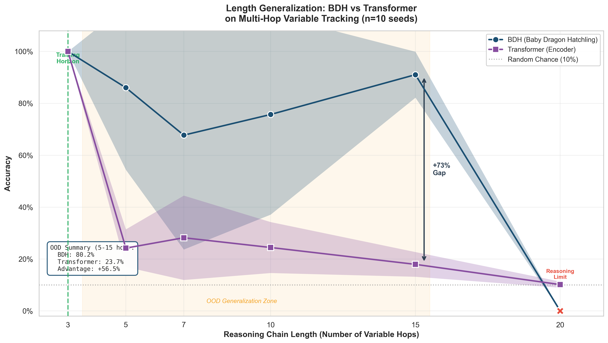
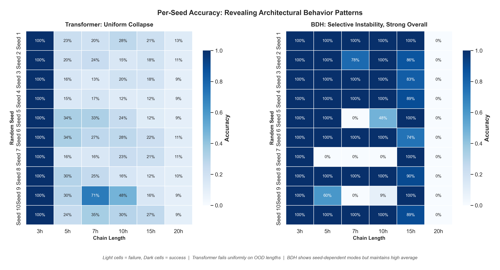
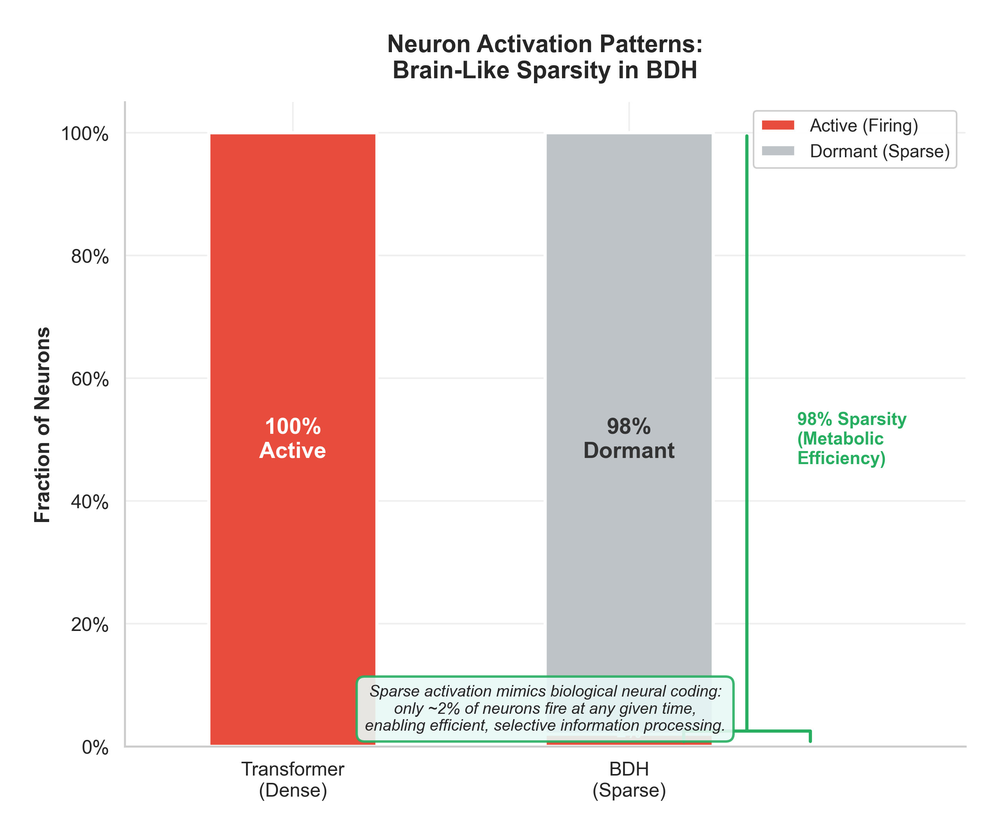

# *Length Generalization in the Baby Dragon Hatchling: A Multi-Hop Reasoning Probe*

[](https://opensource.org/licenses/MIT)
[](https://www.python.org/downloads/)
[](https://pytorch.org/)
[](report/BDH_PROBING.pdf)
[
]()

---

## MAIN RESULT: Generalization Gap



*Figure 1: BDH maintains **80%+ accuracy** up to 5× training length (15-hop), while the Transformer collapses to near-random (~24%) immediately outside the training distribution. At 15-hop chains, BDH achieves a **+73% advantage**.*

---

## TL;DR

- **What we tested:** Can sparse, brain-inspired architectures (BDH) generalize to longer reasoning chains than dense Transformers?
- **What we found:** BDH achieves **80.2% OOD accuracy** vs Transformer's **23.7%** on chains 2-5× longer than training - a **+56.5% gap**.
- **Why it matters:** Length generalization is a critical bottleneck for LLM reasoning; sparse architectures may offer a path forward.

---

## MOTIVATION

**Length generalization** -  the ability to apply learned algorithms to inputs longer than those seen during training — remains an unsolved challenge in deep learning. Large language models struggle to maintain coherent reasoning as problem complexity scales, often collapsing to near-random performance on out-of-distribution (OOD) sequence lengths.

The **Baby Dragon Hatchling (BDH)** architecture (Kosowski et al., 2025) proposes a fundamentally different approach: sparse, multiplicative gating with ~98% neuron inactivity, inspired by biological neural coding. This study probes whether BDH's architectural inductive biases confer superior length generalization on a controlled multi-hop reasoning task.

Genuine curiosity drove this empirical probe, aimed at verifying whether these biological inductive biases translate into measurable reasoning robustness, laying the groundwork for future scalability experiments (such as tackling **ARC-AGI-03** or similar with complementary architectural changes).

---

## METHOD

### Task: Multi-Hop Variable Tracking

We construct a synthetic reasoning benchmark inspired by pointer value retrieval (Zhang et al., 2021) and compositional generalization studies (Lake & Baroni, 2018):

```
Input:  "d = e, b = 8, e = b, c = d, Query: c"
Output: 8  (requires 4-hop chain: c -> d -> e -> b -> 8)
```

The task isolates **systematic variable binding** — a core reasoning primitive — while controlling for confounds like world knowledge or linguistic ambiguity.

### Models

| Architecture          | Layers | Embedding Dim | Parameters | Activation          |
| --------------------- | ------ | ------------- | ---------- | ------------------- |
| **BDH**         | 4      | 128           | 3.15M      | Sparse (~2% active) |
| **Transformer** | 4      | 128           | 865K       | Dense (100% active) |

Both models use identical training hyperparameters: AdamW optimizer, 1500 iterations, batch size 64, learning rate 3e-4 with cosine decay.

### Training vs Testing

- **Training:** 3-hop chains only (in-distribution)
- **Testing:** 3, 5, 7, 10, 15, 20-hop chains (OOD evaluation)

This setup directly probes **length generalization**: can models extrapolate learned reasoning to longer chains?

---

## RESULTS

### Accuracy Across Chain Lengths (N=10 seeds)

| Chain Length | BDH            | Transformer    | Δ (BDH − Trans) |
| ------------ | -------------- | -------------- | ----------------- |
| 3 (ID)       | 100.0% ± 0.0% | 100.0% ± 0.0% | 0.0%              |
| 5 (OOD)      | 86.1% ± 31.7% | 24.2% ± 7.3%  | **+61.9%**  |
| 7 (OOD)      | 67.8% ± 44.1% | 28.2% ± 16.3% | **+39.6%**  |
| 10 (OOD)     | 75.7% ± 38.6% | 24.4% ± 9.8%  | **+51.3%**  |
| 15 (OOD)     | 91.1% ± 8.9%  | 17.9% ± 4.8%  | **+73.2%**  |
| 20 (OOD)     | 0.0% ± 0.0%   | 10.1% ± 1.2%  | −10.1%           |

**OOD Summary (5-15 hop):** BDH **80.2%** vs Transformer **23.7%** = **+56.5% advantage**

### Per-Seed Stability Analysis



*Figure 2: Heatmaps reveal architectural behavior patterns. The Transformer fails **uniformly** across all seeds on OOD lengths (left). BDH shows **seed-dependent modes** — some configurations achieve perfect OOD generalization, while others exhibit selective failures at intermediate lengths (right). This variance suggests BDH learns qualitatively different solutions depending on initialization.*

### Brain-Like Sparsity



*Figure 3: BDH maintains **98% neuron inactivity** during inference, mirroring biological sparse coding. Despite having 3.6× more total parameters, BDH's active compute is comparable to the dense Transformer. This efficiency may explain its superior generalization: sparse representations encourage compositional, reusable features.*

---

## REPRODUCTION

### Requirements

- Python 3.10+
- PyTorch 2.0+
- CUDA-capable GPU (T4 or better recommended)
- ~1 hour total runtime for 10-seed validation (ON T4 Google Colab GPU)

### Quick Start

```bash
# Clone the repository
git clone https://github.com/ssrhaso/bdh.git
cd bdh

# Install dependencies
pip install -r requirements.txt

# Run the full ablation study (10 seeds)
python src/train_reasoning.py

# Generate publication figures
python src/visualize_results.py
```

### Expected Output

```

  FINAL RESULTS: MEAN +/- STD ACROSS 10 SEEDS

  OOD Summary (5-15 hop):
    - BDH Average:          80.2%
    - Transformer Average:  23.7%
    - BDH Advantage:       +56.5%
```

---

### REPOSITORY

```
bdh/
├── README.md                 # This file
├── requirements.txt          # Python dependencies
├── LICENSE                   # MIT License
├── src/
│   ├── bdh.py               # BDH architecture (Pathway Technology)
│   ├── data_generator.py    # Multi-hop reasoning task generator
│   ├── train_reasoning.py   # Main training & evaluation script
│   └── visualize_results.py # Publication figure generation
├── results/
│   └── results.json         # Full experimental results (10 seeds)
├── figures/
│   ├── FIG1_generalization.png  # Main result: accuracy vs chain length
│   ├── FIG2_seed_stability.png  # Per-seed heatmaps
│   └── FIG3_sparsity.png        # Sparsity comparison
└── report/
    └── bdh_reasoning_note.pdf   # 2-page research note
```

---

## LICENSE

This project is licensed under the **MIT License** - see [LICENSE](LICENSE) for details.

---

## ACKNOWLEDGEMENTS

- **Pathway Technology** for the open-source BDH implementation
- Task design inspired by Zhang et al. (2021), Lake & Baroni (2018), and Anil et al. (2022)
- Transformer baseline follows Vaswani et al. (2017) with Pre-LayerNorm (Xiong et al., 2020)

> Full architectural citations are included in code docstrings for traceability as well as report note.
